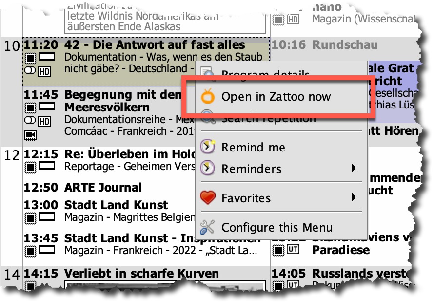
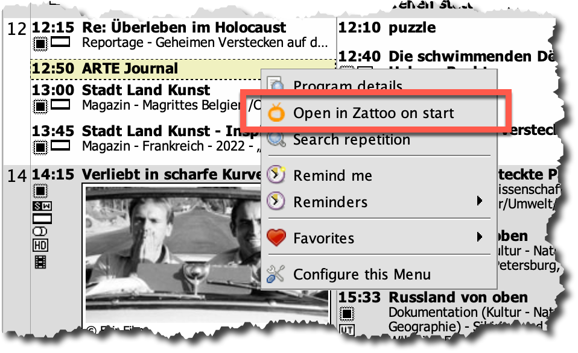
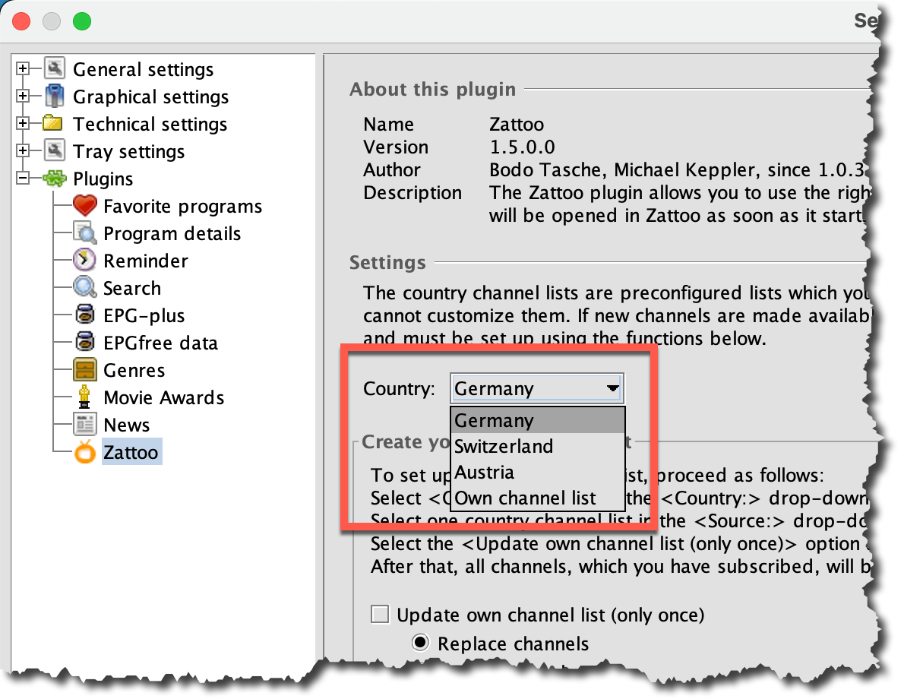

# Zattoo plugin for TV-Browser

Zattoo Plugin 1.0 was developed by Bodo Tasche and Michael Keppler but after version 1.0.2.0 no longer maintained.
The current plugin is based on their work.

## Features

---

* Opens current program in Zattoo
* Mark programs to be opened in Zattoo on start.
* New in 1.5: Country channel list for Austria
* New in 1.5: Create your own channel list

## Requirements

---

* TV-Browser 4.2.4+  
  The plugin was only tested under 4.2.4. The TV-Browers library is of version 3.2.1. I.e., this plugin should run on 
  older versions as well.
* Windows 7+ and maxOS is supported.
* Linux not tested.
* Others not tested.

## Installation

Manuall installation
---

1. Download the file ZattooPlugin.jar from
   [GitHub](https://github.com/sto3014/ZattooPlugin/raw/main/target/ZattooPlugin.jar).
2. Copy the file into the TV-Browser plugin directory:

| Operating System| Path|   
|----|----|   
| Windows 7+ | C:\Users\[username]\AppData\Roaming\TV-Browser\[TV-Browser version]\plugins|   
| Mac OS X| /Users/[username]/Library/Application Support/TV-Browser/plugins|  
| Linux| /home/[username]/.tvbrowser/plugins (until 4.2)   /home/[username]/.config/tvbrowser/plugins (since 4.2.1)|  
| Others| /home/[username]/.tvbrowser/plugins |  

See also [Wiki TV-Browser](https://wiki.tvbrowser.org/index.php/Homeverzeichnis)

3. Restart TV-Browser

## Usage

---
Click with the right mouse button on a programm, you get new popup menu:

* For programs which are currently running you get `Open in Zattoo now`  
    
  This menu opens a new page in your web-browser and displays the channel in Zattoo
* For programs which are not started yet you get `Open in Zattoo on start`  
  
  When the program start, a new page will be opened in your web-browser and displays the channel in Zattoo.
  
If you do not get the expected Zattoo menu, you must use a different channel list. See [Plugin Settings](#plugin_settings) for details.

## Plugin Settings

---
For a program to be opened in Zattoo, the TV-Browser channel must know the Zattoo channel name. This information is
configured in the country channel lists. Therefore, you must choose one country list in the `Country ` combo box. The default
country list is `Germany`. If your Zattoo account is registered in Switzerland or Austria you should select the appropriated 
list.  

But even if one of the three country list fits your country, not all of your subscribed channels may show up the 
Zattoo menu.
So, if your country is not listed at all, or if not all of your channels are valid for Zattoo you must use 
the `Own channel list`. This list is empty by default, and you must set it up. To do so, please follow the 
instructions in the `Create your own channel list` and `Adopt your own channel list` area in the TV-Browser
settings panel.

Your own channel list is stored in a file. Yan can edit/save it in the `Adopt your own channel list` area in the TV-Browser
settings panel. If your prefer, you can edit it in a text editor of your choice.

|    Operating system |Customized channel file     |
|------|-----|
|Windows 7+|C:\Users\[username]\AppData\Roaming\TV-Browser-ZattooPlugin\channels_custom.properties   |
|Mac OS X|/users/[username]/Library/Preferences/TV-Browser-ZattooPlugin/channels_custom.properties |
|Linux| /home/[username]/.config/TV-Browser-ZattooPlugin/channels_custom.properties    |

If there is a format error in your file, only the correct entries will be used. But you can see all entries in the
plugin-settings. If you store the file here the plugin tells you the lines which are not valid.

## Acknowledgements

---
Special thanks to Bodo Tasche and Michael Keppler for developing version 1.0. This good work has made my job 
so much easier.
  

